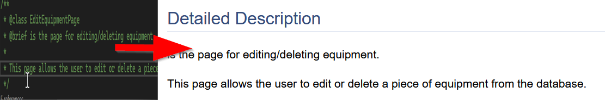

# Documentation

Following on from the work done in week 3, I now need to take the code created in week 3,
refine it, then perform a series of tasks with it.

The tasks are as follows:

* Choose 6 rules of clean code and summarise them
* Provide an example of these rules using the code written in week 3
* Explain how the code implements the rule

After this, I will move onto task 2, which is to make use of [Doxygen](https://www.google.com/url?sa=t&rct=j&q=&esrc=s&source=web&cd=&cad=rja&uact=8&ved=2ahUKEwiglO6tidyBAxXjWUEAHZDSAtkQFnoECAYQAQ&url=https%3A%2F%2Fwww.doxygen.nl%2F&usg=AOvVaw0g-2LaEwos-xH3xaX9Jq0-&opi=89978449)
and copy the comments it generates into this report, where I will then give a descriptive commentary
on their purpose and structure. I will also provide screenshots showing the HTML that has been generated
from my code to illustrate my explanations.

Lastly, I will highlight three examples from my code where I don't need to use comments
as I have followed the principles of clean code.

## Rules of clean code

This section will show the code created for the application from week 3. Then, it will list 6 rules of clean code, with each rule
showing an example in the code which follows these rules, and finally explaining how the example provided implements this rule.

It is important to note, that due to the limited size of the program, multiple rules may be present in the same piece of code. 

The code shown below is for the page titled "EditEquipmentPage".

```
1 -namespace EquipmentSQLite.Views;
2 -using EquipmentSQLite.Models;
3 -
4 -/**
5 - * @class EditEquipmentPage
6 - * @brief is the page for editing/deleting equipment.
7 - * 
8 - * This page allows the user to edit or delete a piece of equipment from the database.
9 - */
10-public partial class EditEquipmentPage : ContentPage
11-{
12-    private Equipment _selectedEquipment;
13-    private string _dbPath;
14-    private EquipmentRepo _equipmentRepo;
15-
16-    /**
17-     * @brief Initializes a new instance of the EditEquipmentPage class.
18-     * @param equipment Which is the item to be edited
19-     * 
20-     * Initializes the page components, the data binding and sets up the database connection
21-     * 
22-     */
23-    public EditEquipmentPage(Equipment equipment)
24-    {
25-        InitializeComponent();
26-
27-        _dbPath = FileAccessHelper.GetLocalFilePath("equipment.db3");
28-
29-        _equipmentRepo = new EquipmentRepo(_dbPath);
30-
31-        _selectedEquipment = equipment;
32-
33-        this.BindingContext = _selectedEquipment;
34-    }
35-
36-    /**
37-     * @brief updates the selectedEquipment with the current input of the textEditor.
38-     * @param sender The button has been clicked on the UI
39-     * @param e Contains the event information
40-     * 
41-     * Updates the selectedEquipment in the database to the current input of the textEditor
42-     * then displays a confirmation message, followed by returning to the previous page.
43-     */
44-    private async void SaveButton_Clicked(object sender, EventArgs e)
45-    {
46-        _selectedEquipment.Name = TextEditor.Text;
47-
48-        _equipmentRepo.UpdateEquipment(_selectedEquipment);
49-
50-        await DisplayAlert("Success", "Equipment updated successfully.", "OK");
51-
52-        await Shell.Current.GoToAsync("..");
53-    }
54-
55-    /**
56-     * @brief deletes the selectedEquipment from the database.
57-     * @param sender The button that was clicked on the UI
58-     * @param e The event information
59-     * 
60-     * Deletes the selectedEquipment from the database, then displays a confirmation message
61-     * followed by returning to the previous page.
62-     */
63-    private async void DeleteButton_Clicked(object sender, EventArgs e)
64-    {
65-        _equipmentRepo.DeleteEquipment(_selectedEquipment);
66-
67-        await DisplayAlert("Success", "Equipment deleted successfully.", "OK");
68-
69-        await Shell.Current.GoToAsync("..");
70-    }
71-}

```

This code is a simple page which opens when the user clicks an item on the UI. The user is then
able to edit and delete the item.

The first rule that this code follows is meaningful names. Meaningful names is pretty self explanatory, it means give
variables, classes, functions, fields etc.. names which make sense, that the reader can understand by reading it
what its purpose is. This rule is clearly shown all throughout the code provided. From the class being "EditEquipmentPage", anyone
can tell this must be the page where someone would be able to edit equipment. Or the fields created on lines 12, 13, 14 are further
examples, with one being called "_selectedEquipment", which is simply the piece of equipment which has been selected. This can be seen
on the entire code page, as time was taken to address any issues on this code snippet.

The second rule that this code follows is KISS(Keep It Simple, Stupid) which means that the creator should
attempt to keep their code simple, not overcomplicating it as the simpler the code is, the easier it is to 
read, understand, and maintain. Again, this is shown throughout this page, with simple names used. It is also relevent
on the methods, which do one thing each. They aren't overcomplicated, they simply do as the method is named and display
an alert. 

The third rule is DRY(Don't Repeat Yourself) which basically means don't create the same code block multiple times,
instead, the designer can put it into a method, a function, or in this example, its own field. The code provided doesn't
have any duplicated code unless absolutely necessary. It did, but this will be discussed later in the reflection section.

The fourth rule is that functions should only do one thing, this of course leads to easier readability, maintenance and debugging.
In the code provided, an example would be the "saveButton_Clicked" method on line 44 which simply updates the equipment name in the
database and returns the user to the previous page.

The fifth rule is YAGNI(You Aren't Gonna Need It). Put simply, don't write code until it's required. This keeps the code clean
and focuses on the current requirements. The code provided doesn't have anything that is unnecessary. Each method has only what
it needs and nothing more. It doesn't contain any placeholders for future development, nor any empty variables/fields/properties.
Thus it fulfils the requirements of YAGNI.

The sixth rule is comment only when necessary. The code provided only contains comments related to Doxygen, and nothing more.
That's because the code follows all the previously listed rules and therefore doesn't need any further comments to explain what
it does. Although, the Doxygen comments do contain information related to each part of the code, however, the code would still
be readable and understandable without them.

## Doxygen Comments Commentary

Doxygen is a tool used by developers which generates documents from comments placed inside the code. All of the comments
in the previously linked snippet, the comments are Doxygen comments. 
In this section, I will link one of these comments and discuss it. This will
involve describing its purpose and structure. Screenshots will also be provided where necessary to illustrate the
points made. 

```
/**
 * @class EditEquipmentPage
 * @brief is the page for editing/deleting equipment.
 * 
 * This page allows the user to edit or delete a piece of equipment from the database.
 */
 ```

 This comment contains tags which have different meanings. The @class tag simply tells the user the name
 of the class. The @brief provides an accurate but minor description of the class, and below that is a more detailed
 explanation. 

 |  |
|:--:|
| <b> Fig.1 - A comment, before and after using Doxygen </b> |

The above image shows how the comment is translated after using Doxygen. Doxygen takes this simple comment and turns it into 
a readable HTML page. This ultimately will allow developers to look at classes purpose without the need of having to look deep
into the program.

## No comments required

In this section, a few examples from the code provided previously will be chosen to show where the need for comments have been
removed, due to the code being well structured and readable. 

First, the variable names used throughout the class, such as "_selectedEquipment" is a self explanatory variable that requires no
further comments. It is obvious what it is to anyone who looks at the code, now or in six months.

Second, the methods, like "SaveButton_Clicked". This method again, uses a simple naming structure which anyone will understand, it doesn't
take in any unnecessary parameters, nor does the inside of the code contain any repeated code. All it does is the exact steps required
to save the information held within the text box which has been input by the user, and saves it to the database. 

Lastly, the class itself. Just like the previous two answers, it has a simple name, where any user can read it and understand what its function is. 
It is focused only on what it is required to do, it doesn't deviate or contain anything that it shouldn't have. It is devoted entirely to 
editing a piece of equipment.

## Reflection

This week has been one of the more difficult weeks. Learning brand new ways to code and comment are obviously going to be tough.
However, after the lesson in week 4, I saw changes I could make to the code I made in week 3 and was able to put it into use prior
to starting this task. I removed repeated code, wasted comments and corrected variable names. This shows personal growth and learning
which I'm happy about, as I often worry that I won't be able to get through the tasks.

Learning Doxygen was reasonably easy. It most likely contains a lot of depth that I haven't seen yet, however, from a basic viewpoint
it wasn't too difficult to learn and adopt into the code. 

The rules of clean code were reasonably easy to follow too. After the quiz in week 4, I feel like I have a decent grasp on all of them
in terms of understanding. Perhaps not in implementing, however, that will come with time. 