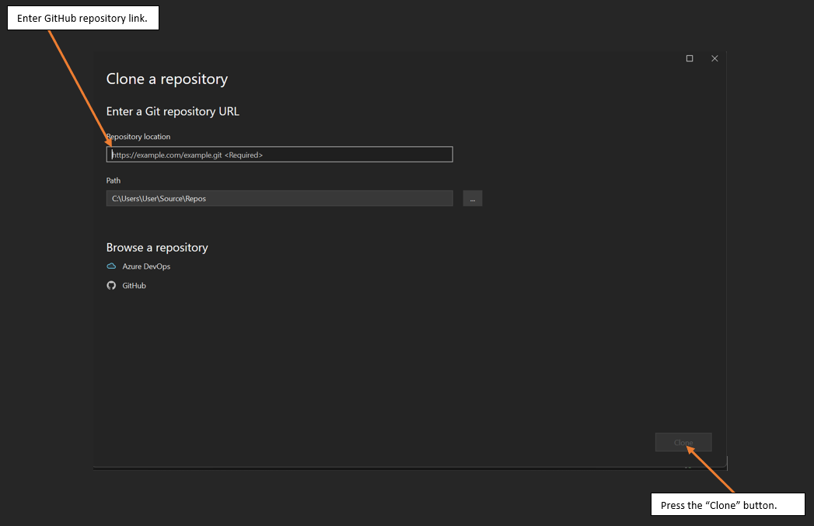
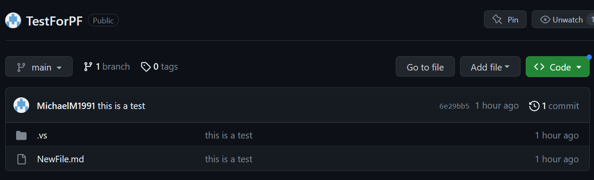

# Portfolio 1: Getting Started

I have been tasked by my lecturer, Brian Davison, to demonstrate that my current development environment is set up correctly and that I have an understanding of the setup as well as other potential configuration settings.

I will achieve this by using screenshots and describing the necessary steps required. However, as this document is not intended for a layman, I will not be including every step. For example, I won't provide instructions on how to download an application but I will provide a link to that application.

Afterward, I will reflect on what I have discussed in this file. I will discuss any problems I have encountered, why the configuration included is appropriate for the task, any limitations the configuration has, and finally, alternative configurations that may be better in the future or with different circumstances.

## Setting Up Development Environment

First, a brief overview of what was required in week 2. 

I had to download [Visual Studio](https://visualstudio.microsoft.com/) and install it. After it was installed, I needed to clone a repository from [GitHub](https://github.com/). 

## Installing Visual Studio

To install [Visual Studio](https://visualstudio.microsoft.com/), click the link and go to the download section. The version I am using is **2022 Community Edition**, which is free for students. During installation, when asked if I required additional packages, I chose no.

## Setting up GitHub

To create a [GitHub account](https://github.com/), click the link and register with GitHub. Afterward, you can then create a [repository](https://docs.github.com/en/repositories/creating-and-managing-repositories/about-repositories). 

## Cloning a GitHub Repository

After completing these steps, I proceeded to clone the git repository that I found on GitHub inside Visual Studio, as shown below:  

|  |
|:--:|
| <b> Fig.1 - Cloning a repository in Visual Studio </b> |

I was then met with an authentication window and had to give approval. I now had access to the files held within the repository on Visual Studio. Authorization only happens the first time you sign in to GitHub from Visual Studio, and details on this can be seen [here](https://learn.microsoft.com/en-us/visualstudio/version-control/git-clone-repository?view=vs-2022).

Afterward, to confirm that the steps taken so far had worked, I created a file and pushed it onto the repository. I then confirmed that this has worked by accessing the GitHub repository online and could see the file had been added, as seen here:

|  |
|:--:|
| <b> Fig.2 - Showing changes pushed to GitHub </b> |

## Understanding 

I will discuss each step of this task individually and discuss the alternate options that I am aware of. It should be noted that the usage of Visual Studio and GitHub is a requirement for the class; thus, different platforms and software will not be discussed.

Setting up Visual Studio is reasonably straightforward, from downloading, installing, and opening the software. However, once it's open, it can be quite daunting. However, I have a few years of experience with it now, and it was mostly familiar. I wasn't familiar with linking to GitHub or incorporating GitHub with Visual Studio, though. But with trial and error and the aid of the internet, I was able to understand how to do things such as clone the repository. I now know why I can't push before I commit, as committing is essentially recording the data and its changes, while pushing sends the content back to the GitHub repository.

I am also aware of other configuration settings I could have used. For example, when installing, there are many packs available that would provide additional capabilities and benefits to Visual Studio. However, after a browse, I didn't see any that seemed relevant to this specific task. Another potential change could have been the version of Visual Studio I downloaded. As mentioned, I am using [Visual Studio Community Edition 2022](https://visualstudio.microsoft.com/vs/), but there are numerous versions of Visual Studio, such as [Visual Studio Professional](https://visualstudio.microsoft.com/vs/professional/) and [Visual Studio Enterprise](https://visualstudio.microsoft.com/vs/enterprise/). These different versions may have features that differ. However, the reason I chose the Community Edition is that it states on the website that it is suitable for students, whereas the others are for teams of varying sizes. This does come with some limitations, as it is intended for individual developers, open source projects, academic research, and small teams of up to 5 users. Professional and Enterprise are for larger teams and come with additional tools.

Setting up GitHub was a different story. I had no prior experience with GitHub, but I had heard of it. Thus, this has been an entirely new experience for me. I have since discovered uses for it and understand how to use it for the limited number of tasks required thus far. I can also see why it is a benefit to individuals and companies, with the comprehensive version control that it provides, the collaboration features, as well as security on projects. In terms of limitations, as I am a free user, I am unable to store more than 500MB total, although I don't see this as being an issue. Another limitation is file size, which is limited to 50MiB per file. MiB means MebiByte, and is different from a MB, in that an MB is 1000000 bytes, and a MiB is 1048576 bytes. This again doesn't seem like it will be a limiting factor in this scenario.

## Reflection

Finally, I will discuss the configuration I have created and the difficulties I faced during the creation of the setup.

I feel that the configuration I have set up thus far is suitable for the tasks I have been presented with. I was able to do the things that were expected. As discussed in the [Understanding](#understanding) section, there are limitations that may ultimately cause some issues. However, as also discussed, I don't think that will be a problem.

For Visual Studio, I don't believe there will be any issues, as team size isn't a limitation when discussing using the software in education. Of course, if this was on behalf of a professional team of more than 5 individuals, the rules would change. Secondly, the packages I chose not to install can be installed at any time, along with even more extensions, so this is a non-issue.

For GitHub, I also do not believe that the limitations will cause any issues for me. As the limitations are largely related to size, it would perhaps cause issues if someone had many repositories, but I will be specifically using this repository for tasks related to this class. And for the limitation of file size, 50MiB for a file, which is most likely going to be a written file or perhaps an image, is incredibly generous and won't be easily reached.

The issues I faced during the steps taken in this document were almost entirely due to my lack of knowledge on GitHub. This is the first time I have ever used GitHub, so it was likely to have teething problems. Issues such as linking the repository to Visual Studio, as an example, I missed the authorization window when it popped up, leading me to believe I wasn't following the process properly. After googling the issue, I found a walkthrough and saw the authorization window, and by starting the process again, it did indeed pop up.

After connecting the two, I had to research how I could interact with GitHub using Visual Studio, which took a lot of trial and error. For instance, I had files on Visual Studio that I could see had been changed, and yet I couldn't push them onto GitHub. This was because I didn't enter a message and commit first, as I didn't even know what these meant. But now, with the research and through trial and error, I understand how to record changes and send them onto GitHub.

These were the issues I faced. However, I am glad they happened, as I have now learned much more about both Visual Studio and GitHub by researching each issue when they occurred. I look forward to the feedback I will get for this task, as ultimately, I would like to improve, and having never touched GitHub or even a markup language, I can see now how useful they are.
