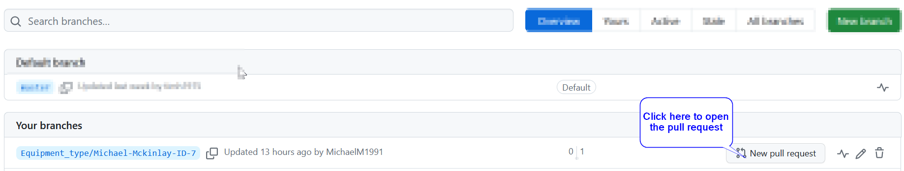

# Portfolio 2: Workflow

This is the second entry to the portfolio, where I will be focusing on the tasks given by my lecturer, Brian Davison.
The tasks for this week are to show that I know how to use the workflow tools in [GitHub](https://github.com/), 
as well carrying out a series of operations on GitHub.

I will do this by making use of screenshots and providing detailed explanations where necessary. 

Afterwards, I will reflect on these tasks and discuss any difficulties faced while doing them and how I resolved them.

## Workflow Tools

The tools which were made use of are contained within this [GitHub Flow](https://docs.github.com/en/get-started/quickstart/github-flow) 
and the information inside is what my team has agreed upon. It should also be known, that the team is making use of a [Kanban Board](https://www.atlassian.com/agile/kanban/boards)
using a webite called [Zube.io](https://zube.io/docs) which has been integrated with the teams GitHub repository. We are also making use of [Discord](https://www.discord.com) for active communication.

The kanban board, described simply, is an online taskboard, where tasks can be listed and people with access to the board can take a task and do it.
They come with a lot of additional functionality and flexability, for example, we chose the sections we wanted to list and gave them names. It is able
to update GitHub in real time, which makes tracking issues and who is resolving them easy to see. 

## Tasks

The tasks I received are as follows:

- Accept a task from the project backlog
- Update the task information appropriately
- Update the task board appropriately
- Complete the development task on a feature branch
- Commit your changes with appropriate comments
- Check your work against the Definition of Done (DoD)
- Make a pull request

I will tackle each of these tasks in order and where necessary, provide screenshots.

### Accepting a task

Accepting a task from the project backlog on GitHub is easy due to the kanban integration. Simply click the
"Issues" button at the top of the GitHub repository to view the active issues. Then, you can choose the issue 
to work on, then when the task is chosen, you can assign yourself to the task, as shown below.

|  |
|:--:|
| <b> Fig.1 - 3 steps to assign a task in GitHub </b> |

### Update the task information

Before or after accepting the task, the user is able to leave a comment. It may be reasonable to leave a comment
with the date that you take the task, as well as when you would expect to hand it in.

### Update the task board appropriately

Updating the task board is made easy with kanban, it can be done on both GitHub and Zube.io. Since the previous example
was shown on GitHub, I will show the process on Zube.io for this step. Below is an image of the kanban board our team is using
on Zube.io.

|  |
|:--:|
| <b> Fig.2 - The kanban board on Zube.io </b> |

As is clearly visible, the kanban board has numerous boxes, and users with access are able to drag and drop
each post into any box they need to, which allows the user to easily update the status of their task. I moved
the task I wanted to tackle into the "In progress" section. 

### Complete the development task on a feature branch

To achieve this, first the user would open the branches section of the GitHub repository, then, they would create their own branch to work on.
The team have agreed on a desired naming system for doing this. It is as follows - feature_name/firstname-surname-ID-issue_number. As can be seen below,
this is how my one looks.

|  |
|:--:|
| <b> Fig.3 - This image shows the task I chose as the branch. </b> |

Afterwards, I opened my Visual Studio and changed the branch on the shared team repository to the name of the branch I created as shown below.

|  |
|:--:|
| <b> Fig.4 - This image shows where to change branch name, and that I have done it. </b> |

To do this, click the dropdown and select "Remote" and the branch should be listed. However, if it is not, you may need to sync
again before trying.

Also, the task I chose was to create a program which would allow the user to add, view, update and delete different types of equipment from
a local database. I achieved this by using the .Net Maui framework in Visual Studio, and SQLite to create the local database. I will not cover
this further, as it is not required. 

### Commit the changes with appropriate comments

To commit the changes, we do it on the same page displayed above, where we changed the branch.
Committing the changes means that the changes will be made locally and not made on the GitHub repository yet.
I will add comments to show that the project has been completed and added to a separate folder, to allow anyone
who looks at it to know what I have added and how to access it as seen below.

|  |
|:--:|
| <b> Fig.5 - This image shows where the user would commit, as well as appropriate comments </b> |

### Check your work against the DoD (Definition of Done)

The definition of done is [when all conditions, or acceptance criteria, that a software product must satisfy are met](https://www.leadingagile.com/2017/02/definition-of-done/).
For the task I picked, the requirements are that the unit tests pass for all CRUD operations. CRUD is create, read, update and delete. Thus, our program need only meet this criteria
to be considered a success. 

I attempted to create unit tests myself for this program, however, I encountered a lot of issues, and with the aid of Google, walkthroughs and even
ChatGPT, I wasn't able to resolve the issues. So, instead of skipping this step, as the tasks are reasonably simple, I opted to manually test them instead.
I tested whether the program was able to perform all the CRUD operations, and do so reasonably, without crashing. I am pleased
to say the program did fulfil these conditions, thus, I have deemed it a success.

### Make a pull request

For the final step, I will perform a pull request. In order to do this, the steps from earlier must be done. Committing the changes, followed by pushing to the branch of the respository.
If the steps have been followed correctly, the user is able to access the "branches" page on the GitHub repository and make a pull request as shown here. 

|  |
|:--:|
| <b> Fig.6 - This image shows step 1 of making a pull request. </b> |

After this step, we will choose the branch that we want to pull the changes to as shown here.

|  |
|:--:|
| <b> Fig.7 - This image shows step 2 of making a pull request by choosing a branch. </b> |

Then, once the branch has been chosen, we can fill in any relevent information in the text box, before
pressing the Create pull request button.

|  |
|:--:|
| <b> Fig.8 - This image shows step 3 of making a pull request by filling in information and creating the request. </b> |

Finally, step 4 is to merge the pull request with the main branch. We do this by clicking the merge pull request button as seen below.

|  |
|:--:|
| <b> Fig.9 - This image shows step 4 of making a pull request by merging to the desired location. </b> |

After confirming, the branch is successfully merged and is able to be deleted. 

## Reflection

Reflecting on the tasks this week is a bit difficult. I found that the first task to describe the tools used as reasonably easy,
I felt that my explanations are reasonable and I included enough information. 

However, when following the workflow tasks, I encountered a lot of issues. As someone who has only been using GitHub for 
a week, I found that it wasn't easy to do some of the tasks. For example, the first three tasks were fine, but the fourth required
the completion of a UI with CRUD operations connected to an SQLite database. I have no experience with the framework which is .Net Maui
nor did I have any experience with C# or SQLite. There were tutorials included, the first one was easy to follow, the second however seemed
to be unrelated to the first, so I had to look elsewhere. After around 14 hours of self learning as well as a lot of trial and error, I managed to get a functional
program. It has a lot of flaws I imagine, and I still have a lot of learning till I fully understand the development process. 

After the issues with getting the program complete, I realised I had made a mistake and was supposed to complete it within the shared repository.
So I added a folder within the repository with my code in it to navigate around the problem. I also attempted unit testing, but found a lot of issues
starting it. After a few hours of guides, I decided that it may be best to come back to this problem another time. 

Finally, interacting with GitHub as a whole has been a bit difficult, as I don't know my way around it and the active communicators on my team
also seem to have little to no experience with it. So I have been using guides and tutorials again to try to work my way through the tasks.
I did the tasks as I expect is required, however, I am not totally certain that the requirements have been met fully, and will await feedback on this.


